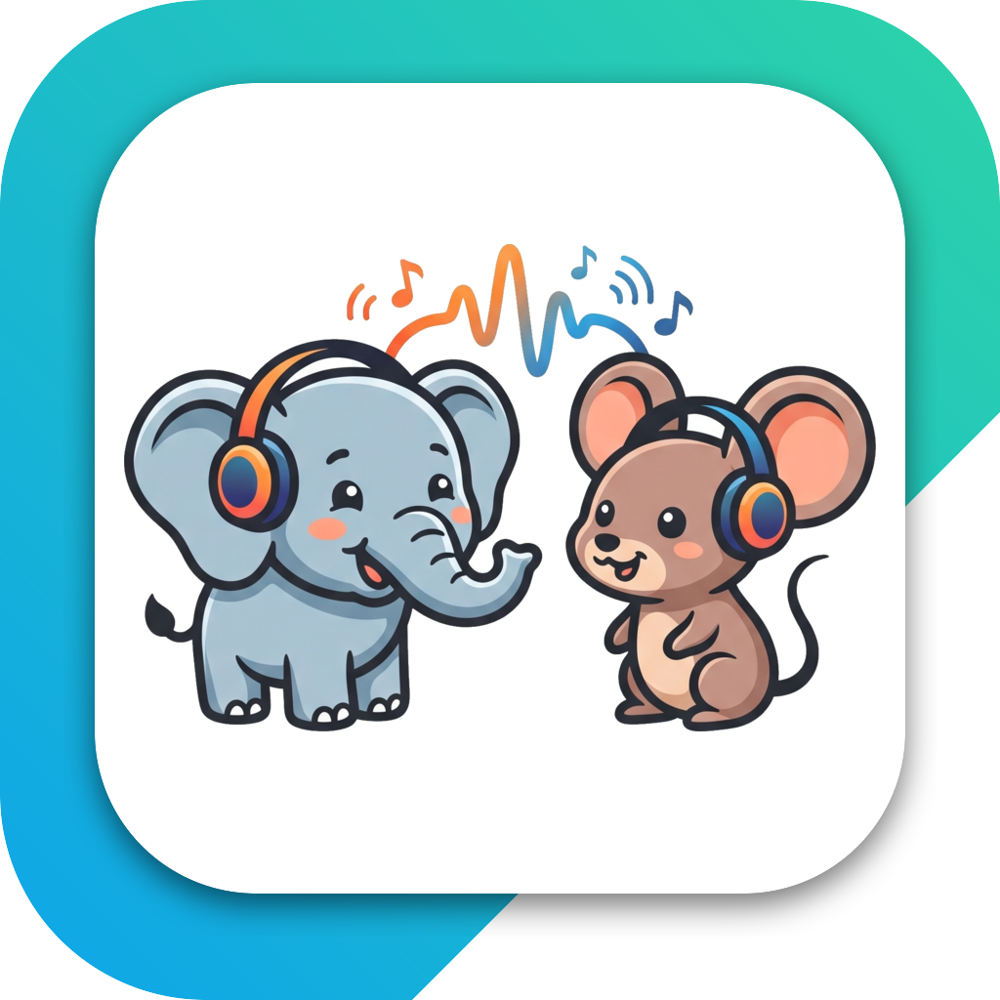

<div align="center">
  
  <h1>hearken</h1>
  <p>Low-latency system-audio bridge between two computers over Tailscale or plain LAN.</p>
</div>

Play audio on one machine, hear it on another — in real time, in either or both directions.
A tiny native app (Go + WebView via [Wails](https://wails.io)) owns the capture/playback
processes: launch it and it just runs.

- **Mac ⇄ Windows** today (any-to-any is scaffolded — see *Status*).
- **Direct over your LAN** when the machines are co-located (Tailscale negotiates a peer-to-peer
  path), or over the internet when they're apart. A plain LAN IP works with no Tailscale at all.
- **Follows the default output device** on Windows (e.g. Bluetooth headphones reconnecting).
- **Auto-discovers** other hearken hosts on your Tailscale, or type / read off an IP.

## Install

Dependencies are installed by a per-OS script; the app assumes they're present and is turnkey
from there. You can also hand the whole thing to an AI agent — see [`install/AGENT-SETUP.md`](install/AGENT-SETUP.md).

**macOS** (host by default):
```bash
bash install/install-mac.sh        # BlackHole + ffmpeg + native helpers + build & sign the app
open build/bin/hearken.app          # then click "Allow" on the mic prompt (one time)
```

**Windows** (client by default):
```powershell
powershell -ExecutionPolicy Bypass -File install\install-windows.ps1
```

## Use

1. Pick **roles**: one machine is **Host** (listens), the other **Client** (dials in). *Auto*
   makes macOS the host and everything else the client.
2. On the **client**, set the host's address — press **Scan** to auto-find hearken hosts on your
   Tailscale, or type the IP shown under *"Others reach this device at…"* on the host. **Save.**
3. Pick a **direction**: *Host→Client*, *Client→Host*, or *Both*.
4. That's it — the host auto-starts and the client auto-connects on every launch thereafter.

## Networking

hearken just streams raw PCM (s16le / 48 kHz / stereo) over TCP to whatever IP you give it:
- **Tailscale** (recommended): each device gets a stable `100.x` address that traverses NAT and
  prefers a direct LAN path. Install + log in on both, or
- **Plain LAN**: type the host's `192.168.x` IP — no Tailscale needed (open the host's firewall
  for ports 45000/45001).

## Dependencies & licenses

hearken does **not** bundle these — the installer pulls them, so there's no license entanglement:

| Dependency | Used for | License |
|---|---|---|
| [BlackHole 2ch](https://existential.audio/blackhole/) | macOS system-audio capture | GPL-3.0 |
| [ffmpeg](https://ffmpeg.org) | macOS playback / format | LGPL/GPL |
| [NAudio](https://github.com/naudio/NAudio) | Windows capture/playback | MIT |
| [Wails](https://wails.io) | app shell | MIT |
| [Tailscale](https://tailscale.com) (optional) | transport | BSD-3 |

## Troubleshooting

- **Windows hears nothing, everything looks healthy** → the macOS host almost certainly lacks
  **Microphone permission** (it then streams digital silence). The signed build keeps the grant
  across rebuilds; if you rebuilt unsigned, re-grant in System Settings → Privacy → Microphone.
- **Crackle / dropouts** → nudge the latency sliders up, or check for a competing large transfer.

## Status

Working: **Mac host ⇄ Windows client** (both directions). Scaffolded but not yet implemented
(see the `UNIMPLEMENTED` TODOs in `app.go` `buildCmd`):
- **Win↔Win**: `capture.exe --listen` + `play.exe --listen`.
- **Mac↔Mac**: a dial-mode `hear-capture` + BlackHole on both Macs.

## Build from source

Needs Go 1.21+, Node, and [Wails v2](https://wails.io/docs/gettingstarted/installation).
```bash
# macOS — build + sign so the mic grant persists across rebuilds:
bash scripts/make-signing-cert.sh   # once
bash scripts/build-mac.sh
# Windows:
wails build
```

## License

MIT — see [LICENSE](LICENSE).
