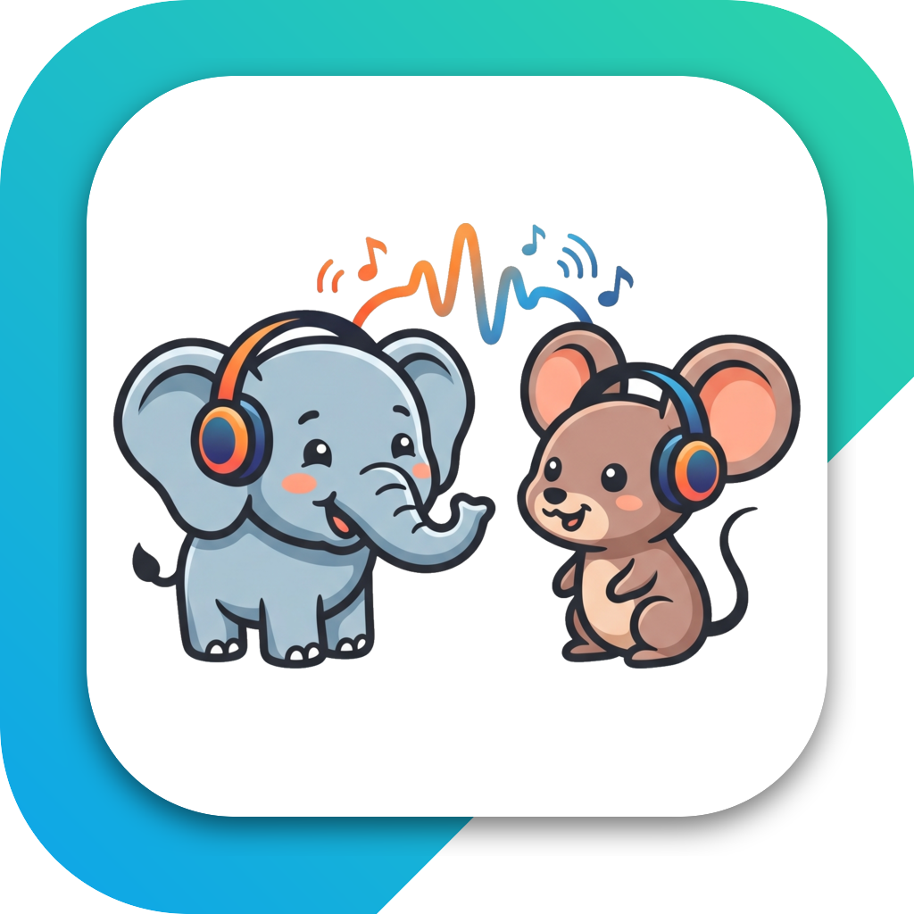

<div align="center">
  
  <h1>hearken</h1>
  <p>Low-latency system-audio bridge between two computers over Tailscale or plain LAN.</p>
</div>

> **Status: experimental. Qualification incomplete.** The transport carries no sequence numbers or
> media timestamps, so once the receiver has confirmed the source is silent it cannot tell "still
> silent" from "resumed, but the bytes are delayed" — a delayed talkspurt is heard late when those
> bytes arrive. The wired Mac→Windows field evidence is an 11-cycle session, not the 100-cycle
> court in the acceptance plan, and it recorded two active-content rebuffer events totalling
> 100 ms. Continuous-content operation, Bluetooth, forced fragmentation and callback-boundary
> races under load are all unqualified. See *Limitations* below.

Play audio on one machine, hear it on another — in real time, in either or both directions.
A tiny native app (Go + WebView via [Wails](https://wails.io)) owns the capture/playback
processes: launch it and it just runs.

- **Mac ⇄ Windows** today (any-to-any is scaffolded — see *Status*).
- **Direct over your LAN** when the machines are co-located (Tailscale negotiates a peer-to-peer
  path), or over the internet when they're apart. A plain LAN IP works with no Tailscale at all.
- **Follows the default output device** on Windows (e.g. Bluetooth headphones reconnecting).
- **Auto-discovers** hearken hosts on your Tailscale **and LAN**, or type / read off an IP.
- **Runs headless in the menubar/tray** (≈25 MB, no browser engine resident); a config window
  opens on demand and frees its WebView on close. Windows playout **measures the link and sizes
  its own buffer** — a few tens of milliseconds on wired Ethernet, more on a bursty Wi-Fi path —
  and corrects small clock drift continuously. A genuinely stale backlog — a blocked sender write,
  a stalled link that then dumps — is trimmed explicitly and counted, rather than silently. There
  is nothing to tune.

## How it runs

hearken installs as a small **login agent** that runs **headless** — just a hearken icon in the
macOS **menubar** / Windows **system tray**, plus the audio bridge. There's no always-open
window (so no ~150 MB browser engine sitting resident). Click the icon → **Open hearken** to
configure; close the window when done and its WebView is freed. **Quit** stops the bridge.

## Install

Dependencies are installed by a per-OS script; the app assumes they're present and is turnkey
from there. You can also hand the whole thing to an AI agent — see [`install/AGENT-SETUP.md`](install/AGENT-SETUP.md).

**macOS** (host by default):
```bash
bash install/install-mac.sh   # installs deps, builds + signs the app, loads the login agent
# then: click the menubar icon → Open hearken → click "Allow" on the mic prompt (one time)
```

**Windows** (client by default):
```powershell
powershell -ExecutionPolicy Bypass -File install\install-windows.ps1   # builds + registers the logon task
# then: click the tray icon → Open hearken
```

## Use

1. Click the **menubar/tray icon → Open hearken**.
2. Pick **roles**: one machine is **Host** (listens), the other **Client** (dials in). *Auto*
   makes macOS the host and everything else the client.
3. On the **client**, set the host's address — press **Scan** to auto-find hearken hosts on your
   Tailscale/LAN, or type the IP shown under *"Others reach this device at…"* on the host. **Save.**
4. Pick a **direction**: *Host→Client*, *Client→Host*, or *Both*, and set **Volume** to taste.
5. Close the window — the daemon keeps running in the menubar/tray; the client auto-connects on
   every login thereafter.

## Networking

hearken just streams raw PCM (s16le / 48 kHz / stereo) over TCP to whatever IP you give it:
- **Tailscale** (recommended): each device gets a stable `100.x` address that traverses NAT and
  prefers a direct LAN path. Install + log in on both, or
- **Plain LAN**: type the host's `192.168.x` IP — no Tailscale needed (open the host's firewall
  for ports 45000/45001).

## Dependencies & licenses

The macOS dependencies are installed, not bundled. **`NAudio.dll` (MIT) is the exception: it is
vendored in this repo and ships inside the Windows release archive**, so its notice travels with it.

| Dependency | Used for | License |
|---|---|---|
| [BlackHole 2ch](https://existential.audio/blackhole/) | macOS system-audio capture | GPL-3.0 |
| [ffmpeg](https://ffmpeg.org) | macOS playback / format | LGPL/GPL |
| [NAudio](https://github.com/naudio/NAudio) | Windows capture/playback | MIT |
| [Wails](https://wails.io) | app shell | MIT |
| [Tailscale](https://tailscale.com) (optional) | transport | BSD-3 |

## Troubleshooting

- **Windows hears nothing, everything looks healthy** → the macOS host almost certainly lacks
  **Microphone permission** (it then streams digital silence). The signed build keeps the grant
  across rebuilds; if you rebuilt unsigned, re-grant in System Settings → Privacy → Microphone.
- **Crackle / dropouts** → press **Mark glitch** when you hear one, then inspect the labelled
  sender/receiver diagnostics for a render gap, network catch-up, starvation, or device reopen.

## Status

Working: **Mac host ⇄ Windows client** (both directions). Scaffolded but not yet implemented
(see the `UNIMPLEMENTED` TODOs in `app.go` `buildCmd`):
- **Win↔Win**: `capture.exe --listen` + `play.exe --listen`.
- **Mac↔Mac**: a dial-mode `hear-capture` + BlackHole on both Macs.

## Build from source

Needs Go 1.23+ (`go.mod` pins 1.23.0), Node, and [Wails v2](https://wails.io/docs/gettingstarted/installation) v2.12.0.
```bash
# macOS — build + sign so the mic grant persists across rebuilds:
bash scripts/make-signing-cert.sh   # once
bash scripts/build-mac.sh
# Windows — hearken.exe AND the two audio helpers:
wails build
$csc = "C:\Windows\Microsoft.NET\Framework64\v4.0.30319\csc.exe"
& $csc /nologo /target:exe /out:lib\capture.exe /r:windows\lib\NAudio.dll windows\lib\capture.cs
& $csc /nologo /target:exe /out:lib\play.exe    /r:windows\lib\NAudio.dll windows\lib\play.cs windows\lib\SquelchProfile.cs
```

`windows\lib\SquelchProfile.cs` and `mac/SquelchProfile.swift` are generated from
`profile/squelch.profile` by `scripts/gen-squelch-profile.py`; `scripts/hygiene_check.sh` fails if
they drift. Both ends must run the same profile hash — they log it on every connection.

## Limitations

- **No authentication or encryption.** hearken streams raw PCM over a plain TCP socket and the
  host listens on all interfaces. Anyone who can reach the port can connect and hear the audio, or
  send audio to it. Run it only across a network path and firewall policy you trust; Tailscale
  provides the transport security here, the application provides none.
- **Delayed resumption is heard late.** See the status note at the top.
- **macOS release builds are unsigned and un-notarized** — right-click → Open the first time. The
  local self-signing script only exists so the microphone grant survives a rebuild on a dev machine.
- **Qualification is incomplete**, as described at the top. Bluetooth endpoints in particular add
  their own codec and radio buffering that no counter here can see.

## License

MIT — see [LICENSE](LICENSE).
